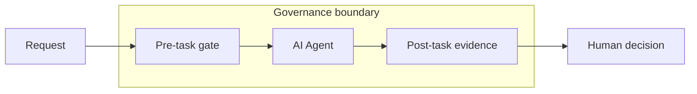

# Content Markdown contract

`decks/**/content.md` is the canonical human-authored deck content. The generated `deck.mjs`, generated `slides.md`, Slidev output, and PPTX output must not be used as round-trip sources.

## Source Markdown pagination contract

When an existing report or briefing Markdown is supplied as source material, its
heading structure is a pagination instruction, not merely a topic hint:

- the single `#` heading maps to the cover slide;
- every `##` heading maps to exactly one following slide;
- H2 sections remain in source order;
- repeated visible numbers such as two separate `## 11` headings still produce
  two separate slides;
- `###` headings, paragraphs, lists, tables, code blocks, and speaker notes stay
  within their owning H1/H2 section;
- when the supplied Markdown is already slide copy, the planner may select visual
  treatment but must not summarize, rewrite, add, or delete audience-visible text;
- it must not merge sections, split a section, reorder sections, or drop one.

Each planned slide records `sourceSection` and `sourceHeading`. These optional
Semantic Model fields do not change either renderer's visible output. The
coverage gate validates count, order, uniqueness, exact source-heading mapping,
and—when `--verbatim` is present—exact audience-visible blocks:

```powershell
npm run source:coverage -- --source <source.md> --deck <generated-deck.mjs> --verbatim
```

This source format is intentionally distinct from canonical Content Markdown.
Source Markdown owns pagination and prose; `content.md` owns the selected
semantic layout and renderer fields. The generated deck must satisfy both the
one-to-one source coverage gate and the normal Semantic Model validation.

For source Markdown that already contains final slide copy, generate the editable
PPTX directly:

```powershell
npm run source:pptx -- --source <source.md> --output <deck.pptx>
```

The `source` Semantic Model layout preserves the exact heading plus ordered
subtitle, paragraph, bullet, numbered, quote, code, small-text, and table-cell
strings. Markdown formatting markers and HTML comments are not audience-visible
text. After writing the PPTX, the command inspects its OOXML and fails unless the
ordered visible text equals the source exactly. This layout is for verbatim
source decks; the original ten governed layouts remain the constrained authoring
surface for structured `content.md`.

The verbatim projector derives only visual intent from the preserved blocks:
`statement` for short emphasis, `list` for three or more list items,
`narrative` for ordinary prose, `dense` for high-density copy, plus dedicated
`table`, `code`, and `cover` variants. Both renderers may change geometry,
editable shapes, color, and typography for these variants. They must not add,
remove, reorder, or rewrite audience-visible strings.

## Default command

```powershell
npm run content:pptx
```

This command performs:

```text
decks/ai-governance/content.md
  -> model/content-markdown.mjs
  -> decks/ai-governance/deck.mjs
  -> model/slide-model.mjs validation
  -> scripts/render-pptx.mjs
  -> dist/ai-governance/ai-governance-editable.pptx
```

Use `npm run content:build` when only the generated Semantic Model module is needed. Use `npm run check` before commit.

## Document header

The first non-empty line is the deck title. One or more blockquote lines provide the description.

```md
# Deck title
> Audience-facing deck description.
```

The projected `deck.description` must be non-empty, single-line, and at most 120 characters. Multiple Markdown blockquote lines are joined with spaces before Semantic Model validation.

## Slide and field syntax

Each slide starts with an allowlisted layout heading. Every layout field uses a level-three heading.

```md
## cover
### eyebrow
AI SLIDE DESIGN SYSTEM
### title
讓 AI 在受控設計空間中生成
### titleBreakAfter
讓 AI 在受控設計空間
### subtitle
從自由排版，轉向可重現的語意版型
```

Text fields may span multiple physical lines; the parser joins them with spaces. Tabs, unknown fields, duplicate fields, missing required fields, and prose outside a `###` field fail closed.

For a deck planned from Source Markdown, add both traceability fields to every
slide section:

```md
### sourceSection
h2:1
### sourceHeading
2 ｜ LLM 是什麼?
```

The cover uses `h1:1`; later H2 sections use `h2:1`, `h2:2`, and so on in
physical source order. These IDs are independent of repeated human-visible page
numbers.

## Lists and structured items

Ordinary lists use Markdown bullets:

```md
### reasons
- 避免自由 CSS 漂移
- 讓品質證據可重現
- 保留人工審查邊界
```

Every array field currently requires exactly three entries. This applies to ordinary lists, process steps, architecture layers, and metrics. One-, two-, and four-item variants fail Semantic Model validation before either renderer runs. See [Array cardinality contract](CARDINALITY_CONTRACT.md) for the compatibility decision and migration guidance.

`titleBreakAfter` is optional on every layout. When present, it must be a
non-empty proper prefix of `title`. Both renderers use it as an explicit visual
line-break intent; changing the title without updating the prefix fails model
validation instead of silently changing the wrap.

Process steps and architecture layers use `title :: detail`:

```md
### steps
- 定義訊息 :: 每頁只保留一個核心觀點
- 產生證據 :: Build、截圖與人工審查
- 核准交付 :: 只交付通過 gate 的輸出
```

Metrics use `label :: value :: detail`:

```md
### metrics
- 語意版型 :: 10 :: 全部進入 allowlist
- 像素差異 :: 0.000% :: 同環境 regression
- 人工審查 :: PASS :: 綁定核准 baseline
```

## Restricted Mermaid diagrams

Use the `mermaid` layout when the diagram itself is authored in Markdown:

````md
## mermaid
### eyebrow
ARCHITECTURE
### title
Governance boundary
### subtitle
Fixed semantic roles make responsibility visible without allowing arbitrary CSS.
### diagram

### caption
Optional audience-facing caption.
````

The contract supports `flowchart TB|TD|BT|LR|RL`, balanced `subgraph ... end`
inside a flowchart, and restricted `sequenceDiagram` participants, messages,
notes, and control blocks. It rejects initialization directives, HTML labels,
interactive `click` or `href`, arbitrary `classDef`/`style`/`linkStyle`, shape
metadata, external URLs, frontmatter delimiters, and unsupported Mermaid diagram
families. Flowcharts may use only the fixed `class <node[,node]> <role>` form,
where `role` is one of `input`, `capability`, `agent`, `tool`, `repository`,
`outcome`, `governance`, or `boundary`; these names select renderer-owned visual
tokens and cannot carry CSS declarations.

The parser normalizes the source, computes its SHA-256, and assigns a generated
asset path under `dist/mermaid-assets/`. Mermaid 11.16.0 renders the SVG with a
fixed configuration; the manifest binds source bytes, SVG bytes, diagram kind,
and asset path. Slidev embeds a data URI from that verified SVG and PptxGenJS
embeds the exact same SVG bytes. Generated SVG and manifest files are outputs,
not round-trip sources. Phase 1 exposes each PPTX diagram as one vector picture;
node-level native PowerPoint shapes are explicitly deferred to Phase 2.

## Required fields by layout

| Layout | Required fields |
| --- | --- |
| `cover` | `eyebrow`, `title`, `subtitle` |
| `key-message` | `eyebrow`, `title`, `subtitle`, `visual`, `evidence` |
| `comparison` | `title`, `accent`, `leftTitle`, `leftItems`, `rightTitle`, `rightItems` |
| `problem-solution` | `title`, `problemTitle`, `problemItems`, `solutionTitle`, `solutionItems` |
| `process` | `eyebrow`, `title`, `steps` |
| `architecture` | `eyebrow`, `title`, `layers` |
| `evidence` | `eyebrow`, `title`, `claim`, `status`, `sources` |
| `metrics` | `eyebrow`, `title`, `metrics` |
| `decision` | `eyebrow`, `title`, `decision`, `reasons`, `owner`, `nextAction` |
| `closing` | `eyebrow`, `title`, `summary`, `actions`, `nextAction` |
| `mermaid` | `eyebrow`, `title`, `diagram`; optional `subtitle`, `caption` |

The Semantic Slide Model remains the authority for title length, list density, evidence status, allowed visuals, and other semantic limits. A Markdown file that is structurally valid can still fail model validation.

`comparison.accent` is a governed semantic token, not free-form styling. The current allowlist contains only `governance`; missing, multiline, or unsupported values fail before either renderer runs.

Semantic validation reports all independent model errors together in deterministic deck, slide, field, and item order. Fixing one field should not be required merely to reveal unrelated errors elsewhere in the same deck. Unknown layouts report their type and common-field errors without guessing at layout-specific fields.

## Generated ownership

- Edit: `decks/**/content.md`.
- Generate, do not edit: `decks/**/deck.mjs`.
- Generate, do not edit: `decks/**/slides.md`.
- Deliver, do not round-trip: `dist/**/*.pptx` and other `dist/**` artifacts.
- Generate, do not edit: `dist/mermaid-assets/*.svg` and its `manifest.json`.

Manual edits made in PowerPoint are intentionally not imported back. Preserve a change by expressing it in Content Markdown, the Semantic Model, the shared theme, or the renderer.
