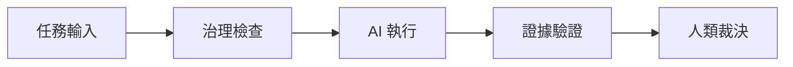
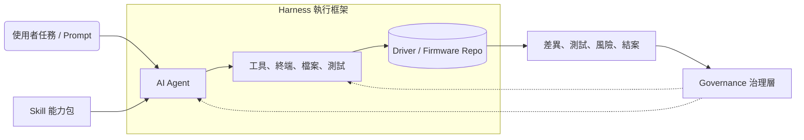
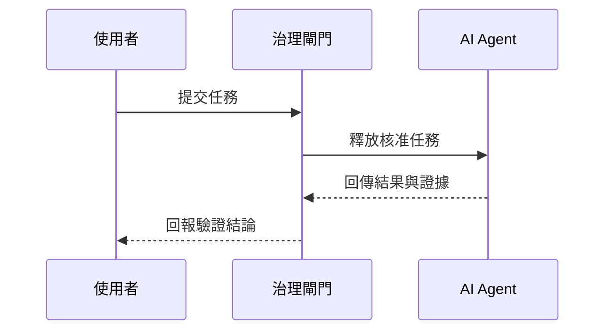

# Mermaid 圖表契約
> 受限 flowchart、subgraph 與 sequenceDiagram 共用固定 SVG。

## mermaid
### eyebrow
FLOWCHART
### title
治理證據流程
### subtitle
顏色代表語意角色；內容仍是受限 Mermaid，不接受任意 CSS 或外部資源。
### diagram

### caption
固定角色色票讓責任與產出可被快速辨識。

## mermaid
### eyebrow
ARCHITECTURE
### title
Prompt、Skill、Agent、Harness 與 Governance 的關係
### subtitle
Prompt 與 Skill 提供任務與做法；Agent 在 Harness 中執行；Governance 橫跨流程並要求證據。
### diagram

### caption
虛線框表示執行與治理邊界；點線箭頭表示治理回饋，不代表執行資料流。

## mermaid
### eyebrow
SEQUENCE
### title
一次任務的治理時序
### subtitle
把權限釋放、執行、證據回傳與人類結論分成可追蹤的交接點。
### diagram

### caption
時序圖只允許參與者、訊息、註記與受限控制區塊。
